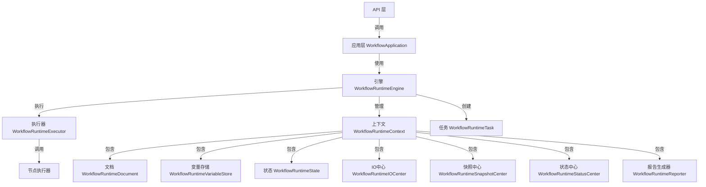
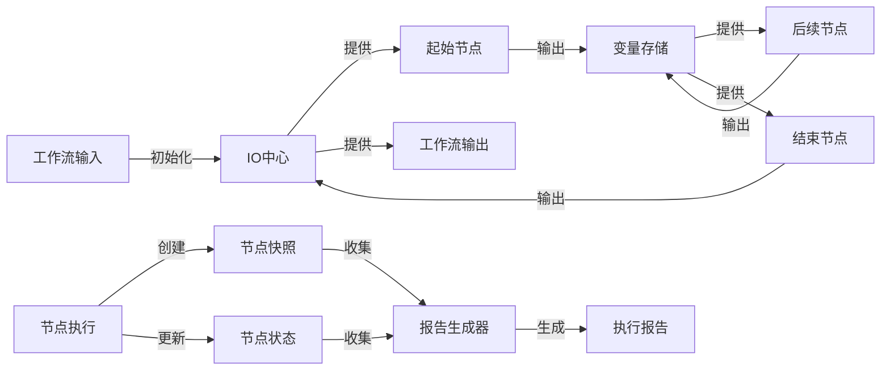

# Runtime-JS-Core 项目分析报告

## 1. 整体架构

Runtime-JS-Core 是一个工作流执行引擎，采用了领域驱动设计（DDD）的架构风格。项目主要分为以下几个层次：

### 1.1 架构分层

- **API 层**：提供对外的接口，包括 TaskRun、TaskReport、TaskResult、TaskCancel 等 API
- **应用层**：负责协调领域对象，处理业务流程
- **领域层**：核心业务逻辑，包含工作流执行的主要组件
- **基础设施层**：提供技术支持，如工具函数等

### 1.2 目录结构

```
runtime-js-core/
├── src/
│   ├── api/                # API 层
│   ├── application/        # 应用层
│   ├── domain/             # 领域层
│   │   ├── container/      # 依赖注入容器
│   │   ├── context/        # 上下文管理
│   │   ├── document/       # 文档处理
│   │   ├── engine/         # 引擎核心
│   │   ├── executor/       # 执行器
│   │   ├── io-center/      # 输入输出中心
│   │   ├── report/         # 报告生成
│   │   ├── snapshot/       # 快照管理
│   │   ├── state/          # 状态管理
│   │   ├── status/         # 状态中心
│   │   ├── task/           # 任务管理
│   │   ├── validation/     # 验证逻辑
│   │   ├── variable/       # 变量管理
│   │   └── __tests__/      # 测试用例
│   ├── infrastructure/     # 基础设施层
│   ├── nodes/              # 节点类型定义
│   └── index.ts            # 入口文件
```

## 2. API 端点实现

### 2.1 TaskRun API

`TaskRun` API 用于启动一个工作流执行任务：

- **输入**：包含工作流模式（schema）和输入参数（inputs）
- **处理流程**：
  1. 解析工作流模式（JSON 格式）
  2. 通过 WorkflowApplication 实例启动工作流执行
  3. 返回生成的任务 ID
- **输出**：包含任务 ID 的对象

### 2.2 TaskReport API

`TaskReport` API 用于获取工作流执行的详细报告：

- **输入**：任务 ID
- **处理流程**：
  1. 通过任务 ID 获取对应的任务
  2. 从任务的上下文中导出报告
  3. 验证报告格式
- **输出**：包含工作流执行详情的报告对象，包括输入、输出、工作流状态和节点报告

### 2.3 TaskResult API

`TaskResult` API 用于获取工作流执行的结果：

- **输入**：任务 ID
- **处理流程**：
  1. 通过任务 ID 获取对应的任务
  2. 检查工作流是否已终止
  3. 返回工作流的输出
- **输出**：工作流执行的输出结果

### 2.4 TaskCancel API

`TaskCancel` API 用于取消正在执行的工作流任务：

- **输入**：任务 ID
- **处理流程**：
  1. 通过任务 ID 获取对应的任务
  2. 调用任务的 cancel 方法取消执行
- **输出**：表示取消操作是否成功的布尔值

## 3. 领域组件分析

### 3.1 Snapshot（快照）组件

快照组件负责记录工作流执行过程中各节点的状态和数据：

- **SnapshotCenter**：管理所有快照的中心，提供创建、导出快照的功能
- **Snapshot**：表示单个快照的实体，包含节点 ID、输入、输出和数据等信息
- **主要功能**：
  - 创建节点执行的快照记录
  - 记录节点的输入和输出
  - 导出快照数据用于生成报告

### 3.2 Report（报告）组件

报告组件负责生成工作流执行的详细报告：

- **Reporter**：报告生成器，汇总工作流执行的各种信息
- **Report**：报告值对象，包含工作流的输入、输出、状态和节点报告
- **主要功能**：
  - 收集工作流执行的输入和输出
  - 收集工作流和节点的状态信息
  - 收集节点执行的快照
  - 生成完整的执行报告

### 3.3 Status（状态）组件

状态组件负责管理工作流和节点的执行状态：

- **StatusCenter**：状态管理中心，管理工作流和所有节点的状态
- **Status**：状态实体，表示单个工作流或节点的状态
- **状态类型**：
  - Pending：等待执行
  - Processing：正在执行
  - Succeeded：执行成功
  - Failed：执行失败
  - Canceled：执行被取消
- **主要功能**：
  - 记录工作流和节点的执行状态
  - 记录执行的开始和结束时间
  - 计算执行耗时
  - 判断工作流是否已终止

### 3.4 Variable（变量）组件

变量组件负责管理工作流执行过程中的变量：

- **VariableStore**：变量存储，管理所有节点的变量
- **Variable**：变量值对象，表示单个变量
- **主要功能**：
  - 存储和检索节点变量
  - 支持变量的层次结构
  - 支持父子上下文的变量继承

## 4. 工作流执行流程

### 4.1 执行引擎

工作流执行引擎（Engine）是核心组件，负责协调工作流的执行：

- **初始化**：创建上下文，初始化各种组件
- **执行流程**：
  1. 从开始节点开始执行
  2. 获取节点的输入
  3. 执行节点逻辑
  4. 记录节点的输出和状态
  5. 确定下一个要执行的节点
  6. 递归执行下一个节点
- **并行执行**：支持多个节点的并行执行
- **分支执行**：支持基于条件的分支执行

### 4.2 任务管理

任务（Task）表示一次工作流执行实例：

- **任务创建**：通过 Engine.invoke 方法创建
- **任务属性**：
  - ID：唯一标识符
  - Context：执行上下文
  - Processing：表示执行过程的 Promise
- **任务方法**：
  - cancel：取消任务执行

### 4.3 上下文管理

上下文（Context）是工作流执行的环境，包含执行所需的所有组件：

- **上下文组件**：
  - Document：工作流文档
  - VariableStore：变量存储
  - State：执行状态
  - IOCenter：输入输出中心
  - SnapshotCenter：快照中心
  - StatusCenter：状态中心
  - Reporter：报告生成器
- **上下文方法**：
  - init：初始化上下文
  - dispose：释放资源
  - sub：创建子上下文

## 5. 节点类型和执行

项目支持多种类型的节点，每种节点有不同的执行逻辑：

### 5.1 节点类型

- **Start**：工作流的起始节点，提供工作流的输入
- **End**：工作流的结束节点，收集工作流的输出
- **Condition**：条件节点，根据条件决定执行路径
- **LLM**：语言模型节点，调用 AI 模型处理文本
- **Loop**：循环节点，对数组元素进行迭代处理

### 5.2 节点执行器

每种节点的执行由专门的执行器（Executor）处理，执行器负责：
- 解析节点配置
- 执行节点逻辑
- 处理节点输入输出
- 确定执行分支

### 5.3 LLM 节点执行器

LLM 节点执行器负责调用语言模型 API 处理文本：

- **输入参数**：
  - modelName：模型名称
  - apiKey：API 密钥
  - apiHost：API 主机地址
  - temperature：温度参数，控制生成文本的随机性
  - systemPrompt：系统提示（可选）
  - prompt：用户提示

- **执行流程**：
  1. 验证输入参数的完整性
  2. 创建 ChatOpenAI 实例
  3. 构建消息列表（系统提示和用户提示）
  4. 调用 AI 模型 API
  5. 返回模型生成的文本结果

### 5.4 条件节点执行器

条件节点执行器负责根据条件判断执行路径：

- **执行流程**：
  1. 获取节点定义的条件列表
  2. 解析每个条件的左值、操作符和右值
  3. 验证条件的类型匹配
  4. 执行条件判断
  5. 返回第一个满足条件的分支

- **条件类型支持**：
  - 字符串类型：等于、不等于、包含、不包含等
  - 数字类型：等于、不等于、大于、小于等
  - 布尔类型：等于、不等于
  - 数组类型：为空、不为空、包含、不包含等
  - 对象类型：为空、不为空等
  - 空值类型：为空、不为空

### 5.5 循环节点执行器

循环节点执行器负责对数组元素进行迭代处理：

- **输入参数**：
  - batchFor：要迭代的数组

- **执行流程**：
  1. 获取循环数组和元素类型
  2. 获取子节点列表
  3. 对数组中的每个元素：
     - 创建子上下文
     - 设置循环变量（item）
     - 并行执行所有起始子节点
  4. 返回空输出（循环节点本身不产生输出）

### 5.6 节点执行流程

节点执行的一般流程如下：

1. 引擎调用节点执行器的 execute 方法
2. 执行器获取节点输入和配置
3. 执行节点特定的业务逻辑
4. 生成节点输出和分支信息（如果有）
5. 引擎根据输出和分支信息决定下一步执行的节点

## 6. 组件关系与交互

### 6.1 核心组件关系

Runtime-JS-Core 的核心组件之间存在以下关系：



### 6.2 工作流执行流程

工作流执行的完整流程如下：

1. **API 调用**：客户端通过 API 调用 WorkflowApplication
2. **任务创建**：WorkflowApplication 创建工作流任务
3. **上下文初始化**：初始化执行上下文，包括文档、变量、状态等
4. **引擎执行**：引擎开始执行工作流
5. **节点执行**：从起始节点开始，按照工作流定义执行各个节点
   - 获取节点输入
   - 执行节点逻辑
   - 记录节点输出和状态
   - 创建节点快照
6. **分支和循环处理**：根据条件节点和循环节点的逻辑决定执行路径
7. **状态更新**：更新工作流和节点的执行状态
8. **结果生成**：收集工作流的输出结果
9. **报告生成**：生成工作流执行的详细报告

### 6.3 数据流向

工作流执行过程中的数据流向如下：



### 6.4 API 与应用层交互

API 与应用层的交互流程如下：

1. **TaskRun API**：
   - 接收工作流模式和输入参数
   - 调用 WorkflowApplication.run() 方法
   - 返回任务 ID

2. **TaskReport API**：
   - 接收任务 ID
   - 调用 WorkflowApplication.report() 方法
   - 返回工作流执行报告

3. **TaskResult API**：
   - 接收任务 ID
   - 调用 WorkflowApplication.result() 方法
   - 返回工作流执行结果

4. **TaskCancel API**：
   - 接收任务 ID
   - 调用 WorkflowApplication.cancel() 方法
   - 返回取消操作是否成功

## 7. 总结

Runtime-JS-Core 是一个功能完整的工作流执行引擎，具有以下特点：

1. **模块化设计**：采用领域驱动设计，各组件职责明确，便于扩展和维护
2. **灵活的执行流程**：支持条件分支、循环和并行执行，适用于复杂的工作流场景
3. **完善的状态管理**：详细记录工作流和节点的执行状态，便于监控和调试
4. **丰富的报告功能**：提供详细的执行报告和结果，便于分析和优化
5. **可扩展的节点类型**：支持多种节点类型，并可通过实现 INodeExecutor 接口扩展新的节点类型
6. **异步执行模型**：基于 Promise 的异步执行模型，支持并行执行和长时间运行的任务

该引擎适用于构建复杂的工作流应用，特别是涉及 AI 模型调用的场景。通过提供的 API，可以方便地集成到其他应用中，实现工作流的自动化执行和管理。
